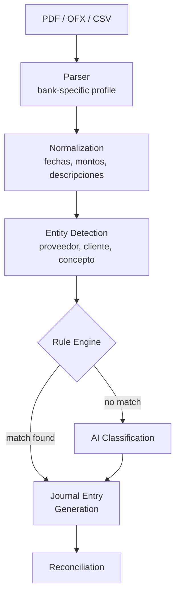

# Bank Import Pipeline

**Status:** Stable (v0.9.0)

---

## Pipeline

---

## Bank profiles

Cada banco tiene su perfil en `src/lib/bank-profiles/`. Definen:

- Posiciones de texto en PDF (coordenadas X/Y)
- Patrones de fechas y montos
- Formato de secciones (checks, deposits, fees)
- Reglas de parsing específicas

Soportados actualmente: **Bank of America**.

---

## Validation

- **Math check:** opening + transactions = closing balance
- Si hay mismatch: `mathValid: false`, transacciones parciales, `AuditLog` registrado
- El mismatch no bloquea la importación — se registra como warning

---

## Error handling

| Situación | Comportamiento |
|---|---|
| PDF ilegible | Error claro, sin crash |
| Mismatch matemático | Warning + `AuditLog`, importación continúa |
| Formato no soportado | Error en parseo inicial |
| Duplicados | Detectados por hash de transacción |
