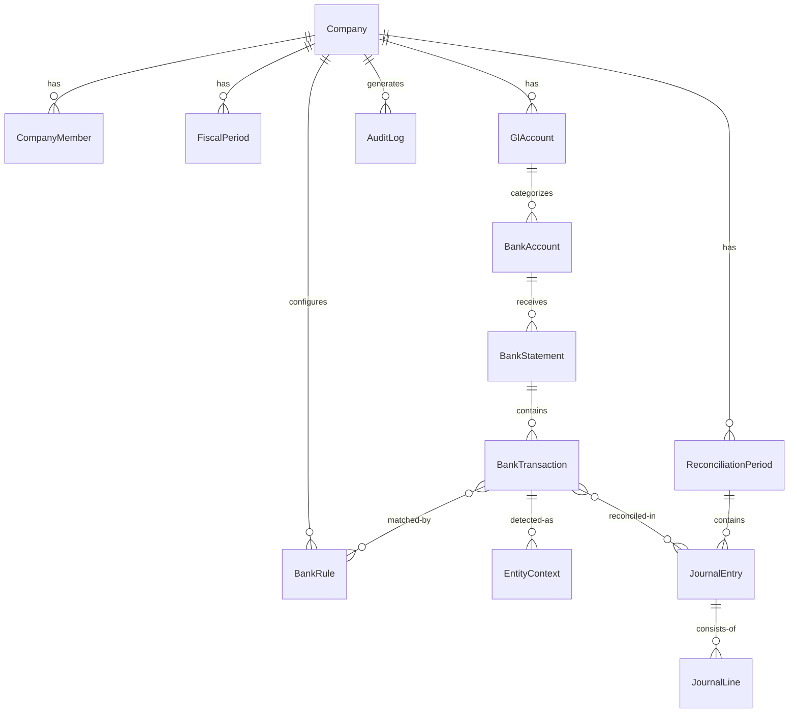
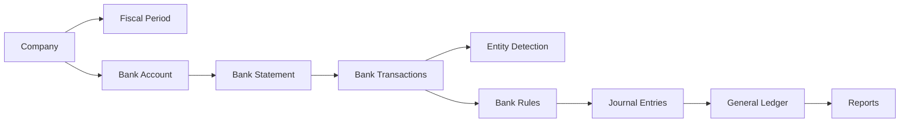

# Architecture Overview

**Status:** Stable (v0.9.0)

---

## Layers

```
┌─────────────────────────────────────────┐
│              Browser (SPA)               │
│  React 19 + Zustand + TanStack Query    │
└──────────────────┬──────────────────────┘
                   │ HTTP/JSON
┌──────────────────▼──────────────────────┐
│           API Routes (Next.js)           │
│  35 endpoints, auth via session cookie   │
│  Rate limiting, companyId extraction     │
└──────────────────┬──────────────────────┘
                   │
┌──────────────────▼──────────────────────┐
│              Services Layer              │
│  reconciliation, import, auth,          │
│  backup, budget, reports, AI assistant  │
└──────────────────┬──────────────────────┘
                   │
┌──────────────────▼──────────────────────┐
│           Decision Engine                │
│  ┌────────────┐  ┌──────────────────┐   │
│  │ Rules      │  │ AI Classifier    │   │
│  │ (determin.)│  │ (probabilistic)  │   │
│  └────────────┘  └──────────────────┘   │
│  Deterministic always has priority      │
└──────────────────┬──────────────────────┘
                   │
┌──────────────────▼──────────────────────┐
│              Prisma ORM                  │
│  PostgreSQL provider, 20 models         │
│  Singleton with safety-net (abort on    │
│  wrong database)                        │
└──────────────────┬──────────────────────┘
                   │
┌──────────────────▼──────────────────────┐
│              PostgreSQL                  │
│  Windows service, no Docker             │
│  Databases: accountexpress, test        │
└─────────────────────────────────────────┘
```

---

## Entity relationship diagram



## Domain entity model

```
Company
├── CompanyMember (users + roles)
├── FiscalPeriod (lockable)
├── GlAccount (chart of accounts, jerárquico)
│   └── BankAccount (vinculado a GlAccount)
│       └── BankStatement (extracto importado)
│           └── BankTransaction (transacción individual)
│               ├── EntityContext (entidad detectada)
│               └── BankRule (regla matcheada)
├── ReconciliationPeriod
│   └── BankTransaction ↔ JournalEntry
├── JournalEntry
│   └── JournalLine (débito/crédito)
├── BankRule (reglas de clasificación)
├── AuditLog (pista encadenada con hashes)
├── SystemMemory (memoria persistente)
├── SystemConfig (config global)
└── CompanyKnowledge (conocimiento de la empresa)
```

---

## Domain data flow



---

## Multi-tenancy

Aislado por `companyId` extraído en cada request (query, header, body o form-data). Todo endpoint verifica membresía via `hasCompanyAccess()`.

---

## Key patterns

| Pattern | Implementation |
|---|---|
| **Client state** | Zustand stores (auth, language) |
| **Server state** | TanStack React Query (cache + sync) |
| **Configuration** | External JSON in `rules/` (24 files) |
| **i18n** | Custom (no next-intl), `src/i18n/locales/{en,es}.ts` |
| **Audit trail** | `AuditLog` with hash chain |
| **PDF parsing** | pdfjs-dist 6, per-bank profiles |
| **Security** | bcryptjs, cookie sessions, rate limiter |

---

## Related docs

- `bank-import.md` — Import pipeline in detail
- `ai-decision-model.md` — How AI integrates
- `rule-engine.md` — Deterministic rule engine (draft)
- `../adr/` — Architecture Decision Records
