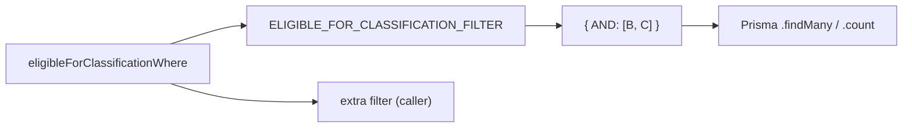

# S5-01: Transaction Classification Invariants — Design

## Architecture Decision

Use a **Prisma `AND` helper** over a spread-based constant to enforce the domain invariant at the query level. This prevents accidental override by any consumer while keeping the Prisma filtering model intact.



## Module Structure

### New file: `src/lib/services/transaction-invariants.ts`

```
src/lib/services/transaction-invariants.ts
├── const ELIGIBLE_FOR_CLASSIFICATION_FILTER
│   ├── type: satisfies Prisma.BankTransactionWhereInput
│   └── mutability: Object.freeze()
└── function eligibleForClassificationWhere(extra?)
    └── returns: { AND: [filter, extra] }
```

### Consumer changes (6 files)

Each refactoring follows the same mechanical pattern:

**Before:**
```ts
const transactions = await db.bankTransaction.findMany({
  where: {
    statementId: { in: statementIds },
    isReconciled: false,
    matchedRuleId: null,
  },
});
```

**After:**
```ts
import { eligibleForClassificationWhere } from '@/lib/services/transaction-invariants';

const transactions = await db.bankTransaction.findMany({
  where: eligibleForClassificationWhere({
    statementId: { in: statementIds },
  }),
});
```

## Defense in Depth: TOCTOU Protection

The SELECT filter alone is **insufficient** for mutating flows. Between the `findMany` and the `updateMany`, another request or process could change a transaction's state (e.g., reconcile it, classify it, link it to a journal entry). The `updateMany` call must re-assert the invariants:

```ts
// Before: unprotected — overwrites regardless of current state
await tx.bankTransaction.updateMany({
  where: { id: { in: debitIds } },
  data: { glAccountId, matchedRuleId },
});

// After: TOCTOU-safe — only touches transactions still eligible
const result = await tx.bankTransaction.updateMany({
  where: eligibleForClassificationWhere({
    id: { in: debitIds },
  }),
  data: { glAccountId, matchedRuleId },
});

if (result.count < debitIds.length) {
  logger.warn('[INVARIANT] Some transactions became protected before update', {
    expected: debitIds.length,
    updated: result.count,
  });
}
```

**Tracking actually-updated IDs:** Since `updateMany` returns only `{ count }`, not the affected IDs, mutating consumers MUST track which IDs were actually updated to avoid applying downstream effects to skipped transactions. The recommended pattern is per-ID update inside the DB transaction:

```ts
const updatedIds: string[] = [];

for (const id of candidateIds) {
  const result = await tx.bankTransaction.updateMany({
    where: eligibleForClassificationWhere({ id }),
    data: { glAccountId, matchedRuleId },
  });
  if (result.count === 1) {
    updatedIds.push(id);
  }
}

// updatedIds is the authoritative set — use it for all downstream effects:
// journal entries, audit logs, response counts, status calculations.
```

This ensures that the transaction boundary guarantees atomicity: if any update fails, the entire transaction rolls back, and no downstream effect leaks for a skipped transaction.

Read-only consumers (`smart-classify`, `simulate`, `pending-entities`, `getEntityCandidates`) need only the SELECT filter since they never write.

## Edge Cases & Rules

| Concern | Decision |
|---|---|
| `extra` overrides an invariant key | `AND` prevents silent override. Prisma intersects both members: `AND: [{ isIgnored: false, ... }, { isIgnored: true }]` → zero rows returned. The caller *can* express the conflict, but cannot silently bypass the invariant |
| Transaction is ignored but also reconciled | Both `isIgnored: true` and `isReconciled: true` → excluded by the filter (correct) |
| Transaction has `glAccountId` via manual edit but no `matchedRuleId` | Excluded by `glAccountId: null` invariant (correct) |
| Predictive reconciliation engine (`predictive-engine.ts`) | NOT in scope — it suggests journal entries for *matching*, not classification |
| `/api/ai-rules/scan` | NOT in scope — it scans description patterns globally, then filters by entity coverage at the candidate level |

## Non-goals

- No changes to `BankTransaction` schema.
- No changes to API contracts or response shapes.
- No introduction of classification status fields — that belongs in S5-02.
